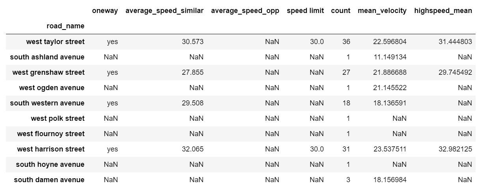

# Automatically Inferring Road Attributes from GPS Trajectories
A method to automatically derive road attributes by analysing and mining movement trajectories (e.g. GPS trajectories). Movement trajectories can be used to automatically derive attribute data in maps.  

The repositary contains code for deriving the **average speed, speed limit and one-way/two-way** attributes of the road.  
The research paper *by Karl van Winden* whose concepts are used in this code can be found [here](http://doi.org/10.1111/tgis.12186)

## Input
The input is a text file which is in the following format: `id,latitude,longitude,timestamp`   
Timestamp in the format: `yyyy-mm-dd hh:mm:ss+03 angle`  

The data used to built the code was from the Chicago taxi data set.  
A [sample text file](sample.txt) is part of the repositary 

## Running the code
The repositary contains a [jupyter notebook](Automatically%20inferring%20road%20attributes%20from%20GPS%20Trajectories%20v1.0.ipynb).  
Run all the cells to get the ouput.  

The repositary also contains a [script](Improved%20Script%20to%20Calculate%20the%20mean%20heading%20and%20Oneway%20attribute%20without%20map%20matching.ipynb) for a more accurate method of determining the oneway/two road attribute without map matching

### Using Custom Input Data
Modify the read_csv command in the second cell of the jupyter notebook  
`df = pd.read_csv("file_name.txt",sep=",",header = None)`

## Output
The code will output a CSV file which is of the format:  
`Road Name , Oneway	, Average_speed_similar	, Average_speed_opp	, Speed Limit	, Count	Mean_velocity	, Highspeed_mean`  

The dataframe of the same can be viewed in the jupyter note book  

